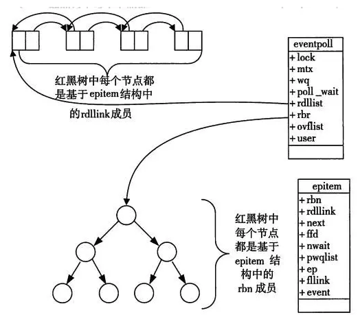

本文讨论的是Linux环境下的network IO，介绍同步（synchronous） IO和异步（asynchronous） IO，阻塞（blocking） IO和非阻塞（non-blocking）IO等概念
<!--more-->

<!-- TOC -->autoauto- [IO模型](#io模型)auto    - [blocking IO  (BIO)](#blocking-io--bio)auto    - [non-blocking IO (NIO)](#non-blocking-io-nio)auto    - [IO multiplexing](#io-multiplexing)auto    - [Asynchronous I/O](#asynchronous-io)auto    - [IO模型总结](#io模型总结)auto- [IO多路复用](#io多路复用)auto    - [基本概念](#基本概念)auto        - [用户空间 / 内核空间](#用户空间--内核空间)auto        - [进程切换](#进程切换)auto        - [进程阻塞](#进程阻塞)auto        - [文件描述符](#文件描述符)auto        - [缓存I/O](#缓存io)auto    - [Select](#select)auto        - [函数介绍](#函数介绍)auto            - [参数说明](#参数说明)auto            - [返回值](#返回值)auto        - [select运行机制](#select运行机制)auto        - [select机制的问题](#select机制的问题)auto    - [Poll](#poll)auto            - [参数说明](#参数说明-1)auto            - [返回值](#返回值-1)auto    - [Epoll](#epoll)auto    - [异步IO总结](#异步io总结)autoauto<!-- /TOC -->

常用的IO模型有五种
- blocking IO
- nonblocking IO
- IO multiplexing
- signal driven IO
- asynchronous IO
由于signal driven IO在实际中并不常用，这里只讨论剩下的四种IO模型。

再说一下IO发生时涉及的对象和步骤。
对于一个network IO (这里我们以read举例)，它会涉及到两个系统对象，一个是调用这个IO的process (or thread)，另一个就是系统内核(kernel)。当一个read操作发生时，它会经历两个阶段：
 1 等待数据准备 (Waiting for the data to be ready)
 2 将数据从内核拷贝到进程中 (Copying the data from the kernel to the process)
记住这两点很重要，因为这些IO Model的区别就是在两个阶段上各有不同的情况。
## IO模型
### blocking IO  (BIO)
在linux中，默认情况下所有的socket都是blocking，一个典型的读操作流程大概是这样：


当用户进程调用了recvfrom这个系统调用，kernel就开始了IO的第一个阶段：准备数据。对于network io来说，很多时候数据在一开始还没有到达（比如，还没有收到一个完整的UDP包），这个时候kernel就要等待足够的数据到来。而在用户进程这边，整个进程会被阻塞。当kernel一直等到数据准备好了，它就会将数据从kernel中拷贝到用户内存，然后kernel返回结果，用户进程才解除block的状态，重新运行起来。</br>
所以，blocking IO的特点就是在IO执行的两个阶段都被block了。

### non-blocking IO (NIO)
linux下，可以通过设置socket使其变为non-blocking。当对一个non-blocking socket执行读操作时，流程是这个样子：


从图中可以看出，当用户进程发出read操作时，如果kernel中的数据还没有准备好，那么它并不会block用户进程，而是立刻返回一个error。从用户进程角度讲 ，它发起一个read操作后，并不需要等待，而是马上就得到了一个结果。用户进程判断结果是一个error时，它就知道数据还没有准备好，于是它可以再次发送read操作。一旦kernel中的数据准备好了，并且又再次收到了用户进程的system call，那么它马上就将数据拷贝到了用户内存，然后返回。</br>
所以，用户进程其实是需要不断的主动询问kernel数据好了没有。

### IO multiplexing
IO multiplexing这个词可能有点陌生，但是如果我说select，epoll，大概就都能明白了。有些地方也称这种IO方式为event driven IO。**我们都知道，select/epoll的好处就在于单个process就可以同时处理多个网络连接的IO。它的基本原理就是select/epoll这个function会不断的轮询所负责的所有socket。**当某个socket有数据到达了，就通知用户进程。它的流程如图：
mu


当用户进程调用了select，那么整个进程会被block，而同时，kernel会“监视”所有select负责的socket，当任何一个socket中的数据准备好了，select就会返回。这个时候用户进程再调用read操作，将数据从kernel拷贝到用户进程。</br>
这个图和blocking IO的图其实并没有太大的不同，事实上，还更差一些。因为这里需要使用两个system call (select 和 recvfrom)，而blocking IO只调用了一个system call (recvfrom)。但是，用select的优势在于它可以同时处理多个connection。（多说一句。所以，如果处理的连接数不是很高的话，使用select/epoll的web server不一定比使用multi-threading + blocking IO的web server性能更好，可能延迟还更大。select/epoll的优势并不是对于单个连接能处理得更快，而是在于能处理更多的连接。）</br>
在IO multiplexing Model中，实际中，对于每一个socket，一般都设置成为non-blocking，但是，如上图所示，整个用户的process其实是一直被block的。只不过process是被select这个函数block，而不是被socket IO给block。</br>

### Asynchronous I/O

linux下的asynchronous IO其实用得很少。先看一下它的流程：


用户进程发起read操作之后，立刻就可以开始去做其它的事。而另一方面，从kernel的角度，当它受到一个asynchronous read之后，首先它会立刻返回，所以不会对用户进程产生任何block。然后，kernel会等待数据准备完成，然后将数据拷贝到用户内存，当这一切都完成之后，kernel会给用户进程发送一个signal，告诉它read操作完成了。

### IO模型总结
到目前为止，已经将四个IO Model都介绍完了。现在回过头来回答最初的那几个问题：blocking和non-blocking的区别在哪，synchronous IO和asynchronous IO的区别在哪。</br>
先回答最简单的这个：blocking vs non-blocking。前面的介绍中其实已经很明确的说明了这两者的区别。调用blocking IO会一直block住对应的进程直到操作完成，而non-blocking IO在kernel还准备数据的情况下会立刻返回。</br>
</br>
在说明synchronous IO和asynchronous IO的区别之前，需要先给出两者的定义。Stevens给出的定义（其实是POSIX的定义）是这样子的：
> A synchronous I/O operation causes the requesting process to be blocked until that I/O operation completes;</br>
> An asynchronous I/O operation does not cause the requesting process to be blocked; </br>

两者的区别就在于synchronous IO做”IO operation”的时候会将process阻塞。按照这个定义，之前所述的blocking IO，non-blocking IO，IO multiplexing都属于synchronous IO。有人可能会说，non-blocking IO并没有被block啊。这里有个非常“狡猾”的地方，定义中所指的”IO operation”是指真实的IO操作，就是例子中的recvfrom这个system call。non-blocking IO在执行recvfrom这个system call的时候，如果kernel的数据没有准备好，这时候不会block进程。但是，当kernel中数据准备好的时候，recvfrom会将数据从kernel拷贝到用户内存中，这个时候进程是被block了，在这段时间内，进程是被block的。而asynchronous IO则不一样，当进程发起IO 操作之后，就直接返回再也不理睬了，直到kernel发送一个信号，告诉进程说IO完成。在这整个过程中，进程完全没有被block。</br>
</br>
各个IO Model的比较如图所示：


经过上面的介绍，会发现non-blocking IO和asynchronous IO的区别还是很明显的。在non-blocking IO中，虽然进程大部分时间都不会被block，但是它仍然要求进程去主动的check，并且当数据准备完成以后，也需要进程主动的再次调用recvfrom来将数据拷贝到用户内存。而asynchronous IO则完全不同。它就像是用户进程将整个IO操作交给了他人（kernel）完成，然后他人做完后发信号通知。在此期间，用户进程不需要去检查IO操作的状态，也不需要主动的去拷贝数据。

##IO多路复用
什么是IO多路复用？
>I/O多路复用（multiplexing）的本质是通过一种机制（系统内核缓冲I/O数据），让单个进程可以监视多个文件描述符，一旦某个描述符就绪（一般是读就绪或写就绪），能够通知程序进行相应的读写操作

select、poll 和 epoll 都是 Linux API 提供的 IO 复用方式。</br>

大家都了解了前面介绍的五中IO模型。除了 asynchronous IO，都可以归类为synchronous IO - 同步IO。</br>

而select、poll、epoll本质上也都是同步I/O，因为他们都需要在读写事件就绪后自己负责进行读写，也就是说这个读写过程是阻塞的。</br>

与多进程和多线程技术相比，I/O多路复用技术的最大优势是系统开销小，系统不必创建进程/线程，也不必维护这些进程/线程，从而大大减小了系统的开销。</br>

### 基本概念
在介绍select、poll、epoll之前，首先介绍一下Linux操作系统中基础的概念：

#### 用户空间 / 内核空间
现在操作系统都是采用虚拟存储器，那么对32位操作系统而言，它的寻址空间（虚拟存储空间）为4G（2的32次方）。
操作系统的核心是内核，独立于普通的应用程序，可以访问受保护的内存空间，也有访问底层硬件设备的所有权限。为了保证用户进程不能直接操作内核（kernel），保证内核的安全，操作系统将虚拟空间划分为两部分，一部分为内核空间，一部分为用户空间。

####进程切换
为了控制进程的执行，内核必须有能力挂起正在CPU上运行的进程，并恢复以前挂起的某个进程的执行。这种行为被称为进程切换。因此可以说，任何进程都是在操作系统内核的支持下运行的，是与内核紧密相关的，并且进程切换是非常耗费资源的。

####进程阻塞
正在执行的进程，由于期待的某些事件未发生，如请求系统资源失败、等待某种操作的完成、新数据尚未到达或无新工作做等，则由系统自动执行阻塞原语(Block)，使自己由运行状态变为阻塞状态。可见，进程的阻塞是进程自身的一种主动行为，也因此只有处于运行态的进程（获得了CPU资源），才可能将其转为阻塞状态。当进程进入阻塞状态，是不占用CPU资源的。

####文件描述符
文件描述符（File descriptor）是计算机科学中的一个术语，是一个用于表述指向文件的引用的抽象化概念。
文件描述符在形式上是一个非负整数。实际上，它是一个索引值，指向内核为每一个进程所维护的该进程打开文件的记录表。当程序打开一个现有文件或者创建一个新文件时，内核向进程返回一个文件描述符。在程序设计中，一些涉及底层的程序编写往往会围绕着文件描述符展开。但是文件描述符这一概念往往只适用于UNIX、Linux这样的操作系统。

####缓存I/O
缓存I/O又称为标准I/O，大多数文件系统的默认I/O操作都是缓存I/O。在Linux的缓存I/O机制中，操作系统会将I/O的数据缓存在文件系统的页缓存中，即数据会先被拷贝到操作系统内核的缓冲区中，然后才会从操作系统内核的缓冲区拷贝到应用程序的地址空间。

### Select

#### 函数介绍
我们先分析一下select函数
>int select(int maxfdp1,fd_set *readset,fd_set *writeset,fd_set *exceptset,const struct timeval *timeout);
##### 参数说明 
- int maxfdp1 
  
指定待测试的文件描述字个数，它的值是待测试的最大描述字加1。</br>

- fd_set *readset , fd_set *writeset , fd_set *exceptset

fd_set可以理解为一个集合，这个集合中存放的是文件描述符(file descriptor)，即文件句柄。中间的三个参数指定我们要让内核测试读、写和异常条件的文件描述符集合。如果对某一个的条件不感兴趣，就可以把它设为空指针。</br>
const struct timeval *timeout timeout告知内核等待所指定文件描述符集合中的任何一个就绪可花多少时间。其timeval结构用于指定这段时间的秒数和微秒数。</br>

##### 返回值
- int
  
 若有就绪描述符返回其数目，若超时则为0，若出错则为-1

#### select运行机制
select()的机制中提供一种fd_set的数据结构，实际上是一个long类型的数组，每一个数组元素都能与一打开的文件句柄（不管是Socket句柄,还是其他文件或命名管道或设备句柄）建立联系，建立联系的工作由程序员完成，当调用select()时，由内核根据IO状态修改fd_set的内容，由此来通知执行了select()的进程哪一Socket或文件可读。</br>
从流程上来看，使用select函数进行IO请求和同步阻塞模型没有太大的区别，甚至还多了添加监视socket，以及调用select函数的额外操作，效率更差。但是，使用select以后最大的优势是用户可以在一个线程内同时处理多个socket的IO请求。用户可以注册多个socket，然后不断地调用select读取被激活的socket，即可达到在同一个线程内同时处理多个IO请求的目的。而在同步阻塞模型中，必须通过多线程的方式才能达到这个目的。</br>

#### select机制的问题
每次调用select，都需要把fd_set集合从用户态拷贝到内核态，如果fd_set集合很大时，那这个开销也很大</br>
同时每次调用select都需要在内核遍历传递进来的所有fd_set，如果fd_set集合很大时，那这个开销也很大</br>
为了减少数据拷贝带来的性能损坏，内核对被监控的fd_set集合大小做了限制，并且这个是通过宏控制的，大小不可改变(限制为1024)</br>

### Poll

poll的机制与select类似，与select在本质上没有多大差别，管理多个描述符也是进行轮询，根据描述符的状态进行处理，但是poll没有最大文件描述符数量的限制。也就是说，poll只解决了上面的问题3，并没有解决问题1，2的性能开销问题。</br>
</br>
下面是pll的函数原型：

``` c
int poll(struct pollfd *fds, nfds_t nfds, int timeout);

typedef struct pollfd {
        int fd;                         // 需要被检测或选择的文件描述符
        short events;                   // 对文件描述符fd上感兴趣的事件
        short revents;                  // 文件描述符fd上当前实际发生的事件
} pollfd_t;
```
poll改变了文件描述符集合的描述方式，使用了pollfd结构而不是select的fd_set结构，使得poll支持的文件描述符集合限制远大于select的1024

##### 参数说明 

- struct pollfd *fds

fds是一个struct pollfd类型的数组，用于存放需要检测其状态的socket描述符，并且调用poll函数之后fds数组不会被清空；一个pollfd结构体表示一个被监视的文件描述符，通过传递fds指示 poll() 监视多个文件描述符。其中，结构体的events域是监视该文件描述符的事件掩码，由用户来设置这个域，结构体的revents域是文件描述符的操作结果事件掩码，内核在调用返回时设置这个域

- nfds_t nfds 

记录数组fds中描述符的总数量

##### 返回值
- int 

函数返回fds集合中就绪的读、写，或出错的描述符数量，返回0表示超时，返回-1表示出错

### Epoll
epoll在Linux2.6内核正式提出，是基于事件驱动的I/O方式，相对于select来说，epoll没有描述符个数限制，使用一个文件描述符管理多个描述符，将用户关心的文件描述符的事件存放到内核的一个事件表中，这样在用户空间和内核空间的copy只需一次。

Linux中提供的epoll相关函数如下：

``` c
int epoll_create(int size);
int epoll_ctl(int epfd, int op, int fd, struct epoll_event *event);
int epoll_wait(int epfd, struct epoll_event * events, int maxevents, int timeout);
```

**1. epoll_create** 函数创建一个epoll句柄，参数size表明内核要监听的描述符数量。调用成功时返回一个epoll句柄描述符，失败时返回-1。</br>
</br>

**2. epoll_ctl** 函数注册要监听的事件类型。四个参数解释如下：</br>

- `epfd` 表示epoll句柄
- `op` 表示fd操作类型，有如下三种
  - EPOLL_CTL_ADD 注册新的fd到epfd中
  - EPOLL_CTL_MOD 修改已注册的fd的监听事件
  - EPOLL_CTL_DEL 从epfd中删除一个fd

- `fd` 是要监听的描述符
- `event` 表示要监听的事件

首先，需要调用epoll_create来创建一个epoll的文件描述符，内核会同时创建一个eventpoll的数据结构。这个数据结构里面会包含两个东西，一个是红黑树，专门用于存储epoll_ctl注册进来的fd文件描述符；另外一个是就绪链表，用来存储epoll_wait调用相关的，已经就绪的那些fd文件描述符。</br>

``` c
struct eventpoll{
    struct rb_root  rbr;      //红黑树的根节点，存储着所有添加到epoll中的需要监控的事件
    struct list_head rdlist;        // 双链表中存放着将要通过epoll_wait返回给用户的满足条件的事件
};
```



epoll_event 结构体定义如下：</br>
``` c
struct epoll_event {
    __uint32_t events;  /* Epoll events */
    epoll_data_t data;  /* User data variable */
};

typedef union epoll_data {
    void *ptr;
    int fd;
    __uint32_t u32;
    __uint64_t u64;
} epoll_data_t;
```

**3. epoll_wait** 函数等待事件的就绪，成功时返回就绪的事件数目，调用失败时返回 -1，等待超时返回 0。</br>
</br>
- `epfd` 是epoll句柄
- `events` 表示从内核得到的就绪事件集合
- `maxevents` 告诉内核events的大小
- `timeout` 表示等待的超时事件


epoll是Linux内核为处理大批量文件描述符而作了改进的poll，是Linux下多路复用IO接口select/poll的增强版本，它能显著提高程序在大量并发连接中只有少量活跃的情况下的系统CPU利用率。原因就是获取事件的时候，它无须遍历整个被侦听的描述符集，只要遍历那些被内核IO事件异步唤醒而加入Ready队列的描述符集合就行了。</br>

epoll除了提供select/poll那种IO事件的水平触发（Level Triggered）外，还提供了边缘触发（Edge Triggered），这就使得用户空间程序有可能缓存IO状态，减少epoll_wait/epoll_pwait的调用，提高应用程序效率。</br>

**水平触发（LT）**：默认工作模式，即当epoll_wait检测到某描述符事件就绪并通知应用程序时，应用程序可以不立即处理该事件；下次调用epoll_wait时，会再次通知此事件
**边缘触发（ET）**： 当epoll_wait检测到某描述符事件就绪并通知应用程序时，应用程序必须立即处理该事件。如果不处理，下次调用epoll_wait时，不会再次通知此事件。（直到你做了某些操作导致该描述符变成未就绪状态了，也就是说边缘触发只在状态由未就绪变为就绪时只通知一次）。

LT和ET原本应该是用于脉冲信号的，可能用它来解释更加形象。Level和Edge指的就是触发点，Level为只要处于水平，那么就一直触发，而Edge则为上升沿和下降沿的时候触发。比如：0->1 就是Edge，1->1 就是Level。</br>

ET模式很大程度上减少了epoll事件的触发次数，因此效率比LT模式下高。</br>

### 异步IO总结

|&nbsp;| select | poll |  epoll  
|----------|------|------|--------|
操作方式 | 遍历 | 遍历 | 回调 | 
底层实现 | 数组 | 链表 | 哈希表 |
IO效率 | 每次调用都进行线性遍历，时间复杂度为O(n) | 每次调用都进行线性遍历，时间复杂度为O(n) | 事件通知方式，每当fd就绪，系统注册的回调函数就会被调用，将就绪fd放到readyList里面，时间复杂度O(1)
最大连接数 | 1024（x86）或2048（x64） | 无上限 | 无上限
fd拷贝 | 每次调用select，都需要把fd集合从用户态拷贝到内核态 | 每次调用poll，都需要把fd集合从用户态拷贝到内核态 | 调用epoll_ctl时拷贝进内核并保存，之后每次epoll_wait不拷贝


epoll是Linux目前大规模网络并发程序开发的首选模型。在绝大多数情况下性能远超select和poll。目前流行的高性能web服务器Nginx正式依赖于epoll提供的高效网络套接字轮询服务。但是，在并发连接不高的情况下，多线程+阻塞I/O方式可能性能更好。</br>
